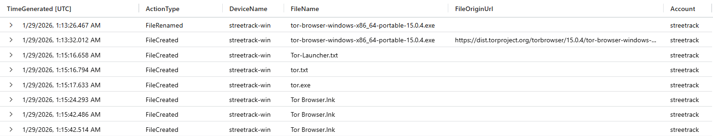
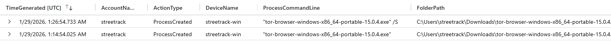
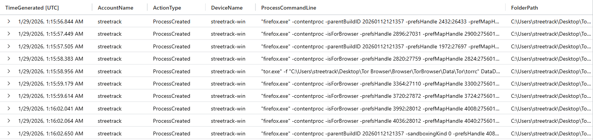
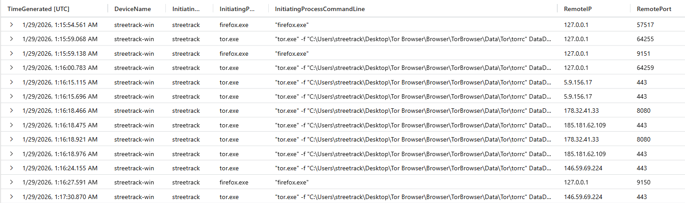

# Threat Hunt Report – TOR Browser Usage Detection

- **Hunt Name:** TOR Browser Usage Detection
- **Author:** Thong Huynh
- **Date:** 2026-01-29
- **Environment:** Microsoft Sentinel + Microsoft Defender for Endpoint
- **Hunt Type:** Hypothesis-Driven Threat Hunt
- **Severity:** Medium (Policy Violation / Security Control Bypass)

---

## Executive Summary

Management raised concerns that employees may be using TOR browsers to bypass corporate network controls after unusual encrypted traffic patterns and connections to known TOR entry nodes were observed in network telemetry. Additional anonymous reports suggested employees were discussing methods to access restricted websites during work hours.

This hunt confirmed the presence and active use of the TOR Browser on a corporate endpoint (`streetrack-win`). Evidence shows the TOR Browser installer was downloaded from the official TOR Project distribution site, executed from a user-writable directory, and successfully established outbound connections to external TOR network nodes.

The activity demonstrates intentional use of anonymization tooling to bypass organizational security controls and web access policies.

**Outcome:**  
- TOR Browser installation and execution confirmed  
- Active TOR network connectivity observed  
- Management notification recommended  

---

## Hunt Objective & Hypothesis

**Objective:**  
Determine whether TOR Browser software is present and actively used on corporate endpoints, and identify any associated network activity that could indicate policy violations or security risks.

**Hypothesis:**  
If TOR Browser is being used to bypass network security controls, then endpoint telemetry will show TOR-related file creation, execution of TOR and bundled Firefox processes, and outbound network connections to known TOR entry nodes over encrypted channels.

---

## Data Sources

| Data Source | Platform |
|------------|----------|
| DeviceFileEvents | Microsoft Defender for Endpoint |
| DeviceProcessEvents | Microsoft Defender for Endpoint |
| DeviceNetworkEvents | Microsoft Defender for Endpoint |

---

## Scope

- **Time Range:** `2026-01-29 01:10–01:30 UTC`
- **Assets in Scope:** Corporate user workstations  
- **Primary Host:** streetrack-win  
- **Primary User Context:** streetrack  

---

## Methodology

This hunt followed a **behavior-first, timeline-driven approach**:

1. Anchored analysis around a suspicious timestamp associated with unusual encrypted traffic
2. Identified TOR-related file creation and download activity
3. Confirmed execution of the TOR Browser installer from a user-writable location
4. Tracked child process creation related to bundled Firefox and tor.exe components
5. Correlated outbound network connections originating from TOR processes
6. Assessed intent based on tool choice, execution flow, and network behavior

Early queries were scoped tightly around known TOR indicators before expanding into process and network correlation.

---

## Investigation Timeline

| Timestamp (UTC) | Event |
|-----------------|------|
| 01:13:26 | TOR Browser installer renamed and written to disk |
| 01:13:32 | TOR Browser installer downloaded from dist.torproject.org |
| 01:15:16–01:15:24 | TOR-related files and shortcuts created |
| 01:14:54 | TOR Browser installer executed from Downloads |
| 01:15:56–01:16:02 | Firefox and tor.exe child processes spawned |
| 01:16:15–01:17:30 | Outbound TOR network connections established |

---

## Key Findings

### TOR Browser Installation and File Artifacts
- TOR Browser portable installer was downloaded directly from the official TOR Project distribution site.
- Multiple TOR-related files (`tor.exe`, launcher files, shortcuts) were created shortly after download.

### Execution from User-Writable Location
- The TOR Browser installer was executed from the user’s Downloads directory, bypassing centralized software deployment controls.

### TOR Process and Firefox Child Execution
- Execution resulted in multiple `firefox.exe` content processes consistent with TOR Browser behavior.
- `tor.exe` was launched with a configuration file pointing to the TOR data directory.

### Active TOR Network Connectivity
- TOR processes established outbound connections over encrypted channels (TCP 443, 8080) to external IPs consistent with TOR entry and relay nodes.
- Initial loopback traffic (`127.0.0.1`) confirmed internal TOR proxy usage before external relay connections.

---

## MITRE ATT&CK Mapping

| Tactic | Technique | ID |
|------|-----------|----|
| Defense Evasion | Encrypted Channel | T1573 |
| Defense Evasion | Proxy | T1090 |
| Command and Control | Proxy | T1090 |
| Execution | User Execution | T1204 |

---

## Indicators of Compromise (IOCs)

| Type | Value |
|----|------|
| Hostname | streetrack-win |
| Account | streetrack |
| File | tor-browser-windows-x86_64-portable-15.0.4.exe |
| Process | tor.exe |
| Process | firefox.exe |
| Network IP | 178.32.41.33 |
| Network IP | 185.181.62.109 |
| Network IP | 146.59.69.224 |

---

## Response Actions

- Notify management of confirmed TOR Browser usage
- Review acceptable use and web access policies with the user
- Remove TOR Browser artifacts from the endpoint
- Monitor for reinstallation or future anonymization tool usage

---

## Detection Gaps & Improvements

This activity was not initially detected as malicious because encrypted outbound traffic and Firefox-based processes can appear benign in isolation.

**Improvements:**
- Alert on execution of TOR Browser installers from user-writable paths  
- Monitor for tor.exe process execution on non-approved endpoints  
- Correlate Firefox child processes with tor.exe parent execution  
- Flag outbound connections to known TOR entry nodes  

---

## Lessons Learned

- TOR Browser usage is easily identifiable through endpoint telemetry when correlated properly  
- File, process, and network data together provide high-confidence attribution  
- User-writable execution paths remain a common bypass vector  
- Policy violations can present significant security and compliance risks even without malware  

---

## Recommendations

- Block TOR Browser downloads at the network perimeter where feasible  
- Enforce application allowlisting on corporate endpoints  
- Educate employees on acceptable use policies and risks of anonymization tools  
- Maintain updated TOR node intelligence for detection and correlation  

---

<details>
<summary><h2><strong>Appendix: Supporting Queries and Evidence (click to expand)</strong></h2></summary>

### Finding: TOR Browser File Creation and Download

```kql
let thistime = datetime('2026-01-29T01:15:50.8910589Z');
DeviceFileEvents
| where DeviceName == "streetrack-win"
| where TimeGenerated between ((thistime - 5m) .. (thistime + 5m))
| where FileName has "tor" or FileOriginUrl has "tor"
| project TimeGenerated, ActionType, DeviceName, FileName, FileOriginUrl, Account = InitiatingProcessAccountName
| order by TimeGenerated asc
```



**Evidence observed:**
TOR Browser installer downloaded from dist.torproject.org and written to disk.

**Why it matters:**
Direct download and execution of anonymization tools violates corporate security policy.

---

### Finding: TOR Browser Execution

```kql
let thistime = datetime('2026-01-29T01:15:50.8910589Z');
DeviceProcessEvents
| where DeviceName == "streetrack-win"
| where TimeGenerated between ((thistime - 20m) .. (thistime + 20m))
| where ProcessCommandLine has "tor-browser-windows-x86_64-portable-15.0.4.exe"
| project TimeGenerated, AccountName, ActionType, DeviceName, ProcessCommandLine, FolderPath, InitiatingProcessFileName
```



**Evidence observed:**
TOR Browser installer executed from the Downloads directory.

**Why it matters:**
Execution confirms intentional use rather than accidental download.

---

### Finding: TOR and Firefox Child Processes

```kql
let thistime = datetime('2026-01-29T01:15:50.8910589Z');
DeviceProcessEvents
| where DeviceName == "streetrack-win"
| where TimeGenerated between ((thistime - 20m) .. (thistime + 20m))
| where InitiatingProcessCommandLine has "firefox.exe" and ProcessCommandLine has "tor"
| project TimeGenerated, AccountName, ActionType, DeviceName, ProcessCommandLine, FolderPath, InitiatingProcessFileName
| order by TimeGenerated asc
```



**Evidence observed:**
Firefox and tor.exe processes spawned as part of TOR Browser execution.

**Why it matters:**
Confirms active TOR Browser runtime behavior.

---

### Finding: TOR Network Connectivity

```kql
let thistime = datetime('2026-01-29T01:15:50.8910589Z');
DeviceNetworkEvents
| where DeviceName == "streetrack-win"
| where TimeGenerated between ((thistime - 5m) .. (thistime + 5m))
| where ActionType has "connectionsuccess"
| where InitiatingProcessFolderPath has "tor"
| project TimeGenerated, DeviceName, InitiatingProcessAccountName, InitiatingProcessFileName, InitiatingProcessCommandLine, RemoteIP, RemotePort, RemoteUrl, Protocol, LocalPort, LocalIP
| order by TimeGenerated asc
```



**Evidence observed:**
Outbound encrypted connections to external TOR nodes were established.

**Why it matters:**
Network connectivity confirms active anonymized browsing activity.

</details>


